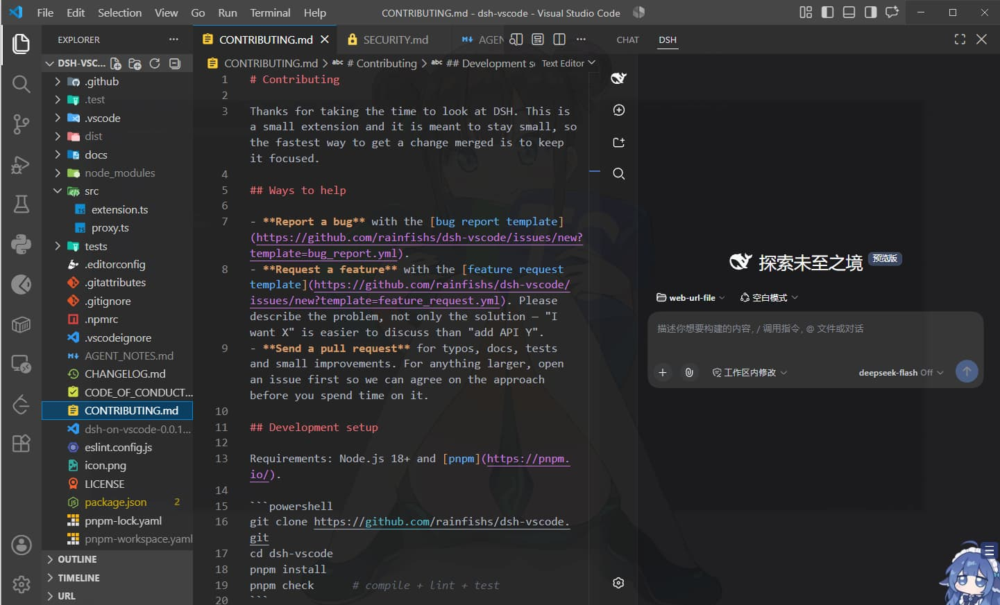

<div align="center">


# DSH on VS Code

### 為 VS Code 打造的輕量、無縫 DeepSeek Harness (DSH) 工作區整合方案

[](https://marketplace.visualstudio.com/items?itemName=rainfishs.dsh-on-vscode)
[](LICENSE)
[](https://code.visualstudio.com/)
[](https://github.com/deepseek-ai/deepseek-harness)

[English](README.md) | **繁體中文**

</div>

---

<p align="center">
  
</p>

---

**DSH on VS Code** 將 [DeepSeek Harness (DSH)](https://github.com/deepseek-ai/deepseek-harness) 的 Web 介面無縫嵌入至 VS Code 聊天面板。

專案採用**輕量解耦架構**：不鎖死外部進程、不依賴 stdout 輸出爬取，透過雙向 IPC 解決 Webview 沙盒限制，讓 DSH 順暢融入你的日常開發流程。

---

## ⚡ 架構總覽

捨棄傳統的子進程綁定（Process Spawning），DSH on VS Code 採用簡潔的**會合檔案模式（Rendezvous File Pattern）**搭配**兩段式 IPC 橋接（Two-Hop IPC Bridge）**：

```text
┌─────────────────────────────────────────────────────────────┐
│                        VS Code Host                         │
│  ┌───────────────────────┐       ┌───────────────────────┐  │
│  │   Secondary Sidebar   │       │  Loopback Proxy Core  │  │
│  │  (Webview Container)  │       │ (Per-Window Isolation)│  │
│  └───────────▲───────────┘       └───────────▲───────────┘  │
│              │ (postMessage IPC)             │              │
└──────────────┼───────────────────────────────┼──────────────┘
               │                               │
       [ Two-Hop Bridge ]            [ HTTP / WebSocket ]
       • System Clipboard Sync                 │
       • Native File Jump (Range)              │
               │                               ▼
┌──────────────▼──────────────────────────────────────────────┐
│                    DSH Runtime & Web GUI                    │
│    (Atomic Rendezvous URL File + SameSite Cookie Widening)   │
└─────────────────────────────────────────────────────────────┘
```

---

## ✨ 核心功能

* 🚀 **原生工作區整合**：直接掛載至次要側邊欄或聊天面板分頁，不干擾編輯器現有排版。
* 📁 **編輯器原生跳轉**：在 DSH 內點擊檔案或錯誤堆疊（Stack Trace），立即於 VS Code 編輯器開啟檔案並跳至對應行號。
* 📋 **兩段式剪貼簿橋接**：繞過 Chromium Iframe 沙盒限制，讓 DSH 的複製功能直接寫入系統剪貼簿。
* 🛡️ **多視窗儲存隔離**：透過本機反向代理 Origin，避免多個 VS Code 視窗共用與覆寫 `localStorage`。
* 🔄 **會合檔案自動重載**：監聽登入 URL 檔案，DSH 啟動後自動同步載入，無須手動配置 Port。
* 🔍 **即時視圖縮放**：支援 CSS 縮放（0.25× 至 4.0×），調整比例時不重載頁面、不中斷進行中的對話與 WebSocket。

---

## 📦 環境需求

| 元件 | 支援版本 | 說明 |
| :--- | :--- | :--- |
| **VS Code** | `^1.104.0` | 宿主編輯器 |
| **DeepSeek Harness** | `latest`（`@deepseek-ai/dsh`） | DSH 核心套件 |
| **[dsh-vscode-bridge](https://github.com/rainfishs/dsh-vscode-bridge)** | `latest` | DSH 端 Cordis 執行期外掛 |

---

## 🚀 快速開始

### 1. 安裝 DSH 擴充套件
將 Bridge Bundle 加入 DSH 的 Web Profile：
```bash
dsh plugin --profile web add github:rainfishs/dsh-vscode-bridge
```

### 2. 安裝 VS Code 擴充套件
從 [VS Code Marketplace](https://marketplace.visualstudio.com/items?itemName=rainfishs.dsh-on-vscode) 安裝，或在終端機執行：
```bash
code --install-extension rainfishs.dsh-on-vscode
```

### 3. 啟動與連線
1. 啟動 DeepSeek Harness：
   ```bash
   dsh web
   ```
   *（Bridge 會自動將登入 URL 寫入 `%USERPROFILE%\.dsh\profiles\web\web-url.txt`）*
2. 開啟面板，兩種方式都可以：

   - **UI 操作：** `Ctrl+Alt+B`（macOS：`Cmd+Option+B`）→ 點擊次要側邊欄的 **DSH** 圖示
   - **命令面板：** `Ctrl+Shift+P`（macOS：`Cmd+Shift+P`）→ 執行 **DSH: Open URL Tab**

---

## ⚙️ 設定選項

在 VS Code `Settings`（`Ctrl+,`）搜尋 `dsh` 可進行調整：

| 設定項目 | 型別 | 預設值 | 說明 |
| :--- | :---: | :---: | :--- |
| `dsh.urlFile` | `string` | `""` | 會合 URL 檔案路徑。支援絕對路徑、工作區相對路徑或 `~`。留空時預設讀取 `%USERPROFILE%\.dsh\profiles\web\web-url.txt`。 |
| `dsh.zoom` | `number` | `1.0` | 視圖縮放比例（`0.25` 至 `4.0`），即時套用不重載分頁。 |
| `dsh.isolateStorage` | `boolean` | `true` | 啟用多視窗本機代理，隔離各視窗的 `localStorage`。 |

---

## 🔧 運作原理

### 1. 兩段式雙向 IPC（Two-Hop Bidirectional IPC）
* **剪貼簿轉送**：`dsh-vscode-bridge` 攔截 Iframe 內的 `writeText` 並透過 `postMessage` 往上傳遞，VS Code Extension Host 接收後使用原生 API 寫入系統剪貼簿。
* **檔案點擊導航**：點擊檔案連結（`dsh-resource://file/...`）直接透過 IPC 轉送至 Extension Host，以 `vscode.window.showTextDocument` 開啟並跳轉至指定行號。

### 2. 動態埠號代理與 Storage 隔離
為了解決多視窗共享同一個 Origin 時 `localStorage` 互相踩踏的問題，擴充套件會依據工作區路徑雜湊出專屬 Port 啟動輕量本機反向代理，達成各視窗獨立儲存空間。

---

## 🛠️ 疑難排解

所有執行狀態與 IPC 紀錄皆輸出於 **DSH 輸出頻道**（檢視 ▸ 輸出 ▸ 選擇 **DSH**）：

| 狀況 | 原因 | 處理方式 |
| :--- | :--- | :--- |
| `No URL configured` | 尚未生成 URL 檔案 | 啟動安裝了 Bridge 的 `dsh web`，或在設定指定 `dsh.urlFile`。 |
| `Cannot read that file` | 路徑錯誤或無讀取權限 | 檢查檔案路徑與權限設定。 |
| 點擊複製無反應 | DSH 端未安裝 Bridge | 執行 `dsh plugin --profile web add github:rainfishs/dsh-vscode-bridge`。 |
| 多視窗狀態互相覆蓋 | 儲存隔離被關閉 | 確認設定中的 `dsh.isolateStorage` 為 `true`。 |

---

## 🔒 安全性與隱私

* **純本機執行**：反向代理與通訊機制僅綁定 `127.0.0.1`。
* **零遙測收集**：不收集任何使用者資訊，無第三方外部網路請求。
* **標頭校正**：轉發請求時會重寫 `Origin` 與 `Host` 標頭，符合 DSH 本地的安全檢查。

---

## 📄 授權

本專案採用 **[MIT License](LICENSE)** 開源授權。

---

<div align="center">
<sub>由 <a href="https://github.com/rainfishs">rainfishs</a> 開發維護。非 DeepSeek 官方附屬專案。</sub>
</div>